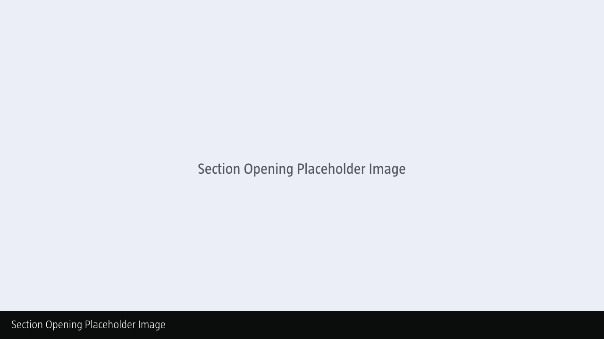

Chapter 5: Designing Mobile Interfaces
======================================

<!-- 539 Words -->

**As I’ve noted in the [overview](https://github.com/fehler/building-beautiful-uis/blob/master/00-Overview.md), this is a work in progress and I’m sharing it here in draft form. It isn’t finished, but I hope it provides some value as I finalise all of the chapter content.**

Table of Contents
-----------------

/* This is very rough and needs a day to tidy it all up. I'll Post-It out this chapter and the preceding chapter when I get to Donegal this weekend. [15 May, 2019] */

+ [Section 1: Mobile First](#)
+ [Section 2: Tap Targets (Sizes, etc.)](#)
+ [Section 3: Reachability](#)
+ [Section 4: Task-Focused User Interfaces](#)
+ [Section 5: ????](#)

/*

Cross-reference Luke W's book.

The emergence of mobile contexts has changed interface design dramatically. We now have:

+ Touch
+ Force Touch
+ Voice
+ Etc..

*/

Summary
-------

**Summary goes here…**

Overview
--------

This chapter should stress the importance of a 'mobile-first' approach and highlight the benefits that this brings. Largely this is about focusing the interface down to the core elements and building from that.

Users are busy, so focus is essential. Your task as a designer is to enable users to get the job done as quickly as possible, ideally:

1. Minimising interruption; and
2. Maximising delight.

Delight isn't just about beautiful interactions (animations, for example), it's also about enabling users to get what they need to get done as quickly as possible.

We can learn a lot from content-first sites like GOV.UK, where a considerable amount of time is invested in distilling down complex information so that it's easy to parse and act upon.

A section needs to be dedicated to tap targets and reachability, which in a mobile context are of primary importance.

Section 1: XXXX
--------------------------

**CAPTION: Caption here.**

Part 1 goes here…

Section 2: XXXX
--------------------------

**CAPTION: Caption here.**

Part 2 goes here…

Section 3: XXXX
--------------------------

**CAPTION: Caption here.**

Part 3 goes here…

Section 4: XXXX
--------------------------

**CAPTION: Caption here.**

Part 4 goes here…

Section 5: XXXX
--------------------------

**CAPTION: Caption here.**

Part 5 goes here…

Further Reading
---------------

+ Luke W's [Mobile First](#) book – despite being published in XXXX – is still worth reading for its focus on the benefits of a mobile-first approach.

+ Item 2

+ Item 3

About the Author
----------------

### Christopher Murphy

[@fehler](https://www.twitter.com/fehler)

A designer, writer and speaker based in Belfast, Christopher mentors purpose-driven businesses, helping them to launch and thrive. He encourages small businesses to think big and he enables big businesses to think small.

The author of numerous books, he is currently hard at work on his eighth, ‘Designing Delightful Experiences’, for Smashing Magazine and ninth, ‘Building Beautiful UIs’, for Adobe. Both are accompanied by a wealth of digital resources, and are drawn from Christopher’s 15+ years of experience as a design educator.

As a design strategist he has worked with companies, large and small, to help drive innovation, drawing on his 25+ years of experience working with clients including: Adobe, EA and the BBC.

---

I hope you find this resource useful. I’m also currently working on a book for the fine folks at [Smashing Magazine](https://www.smashingmagazine.com) – ‘Designing Delightful Experiences’ – which focuses on the user experience design process from start to finish. It will be published in late 2019.

You might like to [follow me](https://www.twitter.com/fehler) on Twitter for updates on this book, that book and other projects I’m working on.

**Copyright · Adobe XD + Mr Murphy Ltd.**