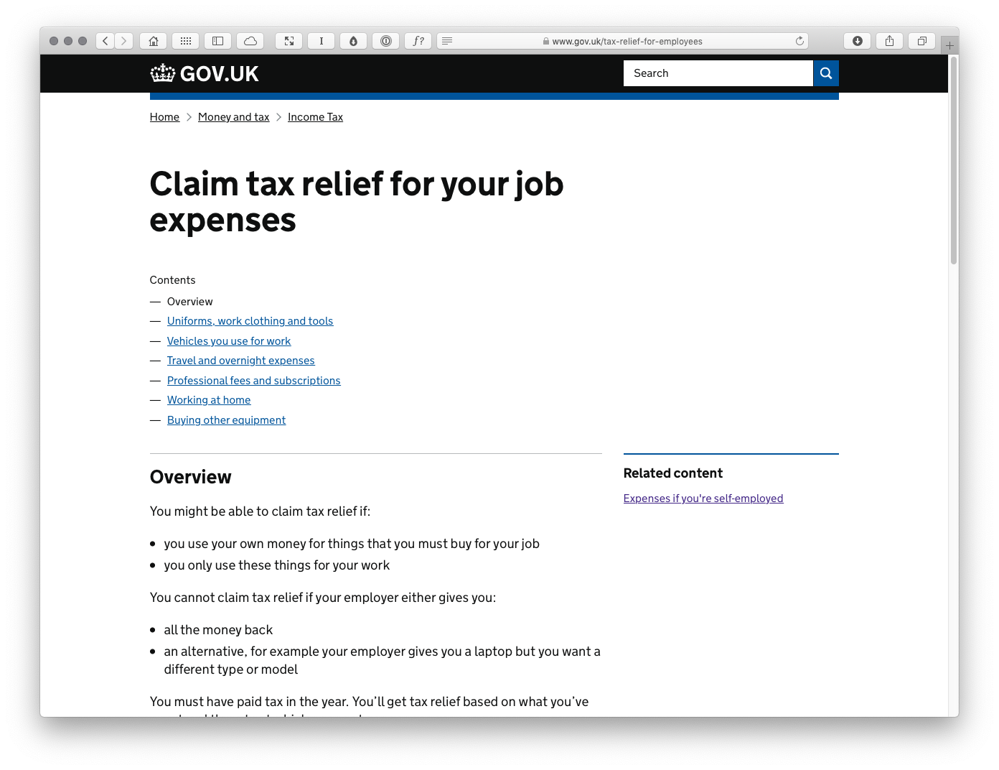
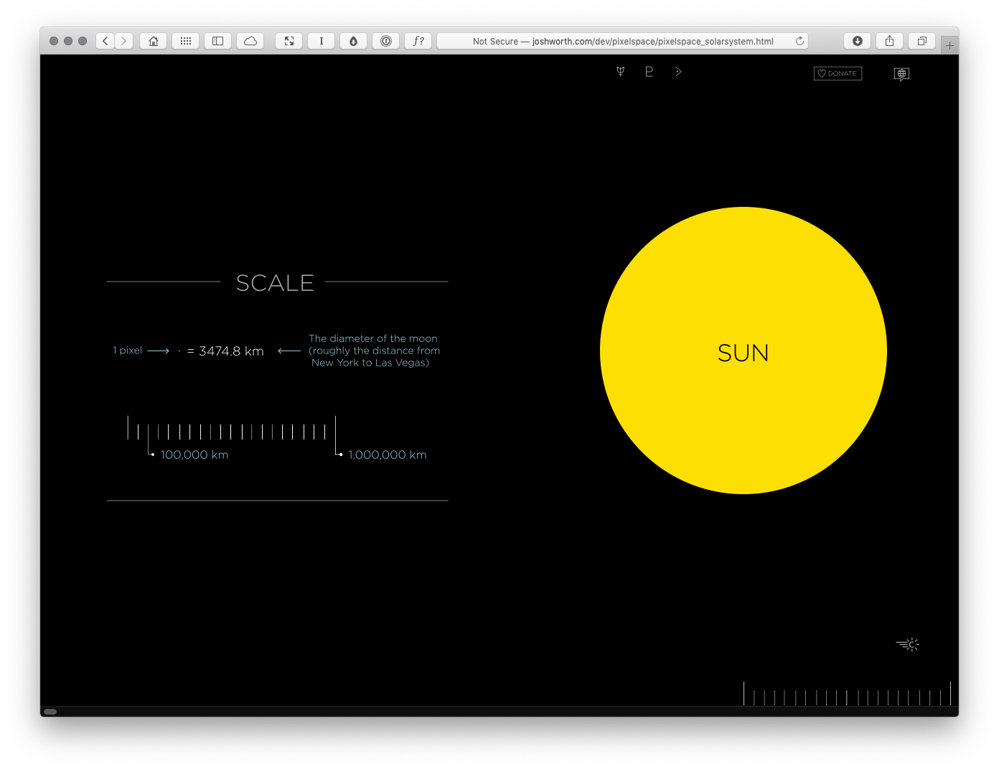
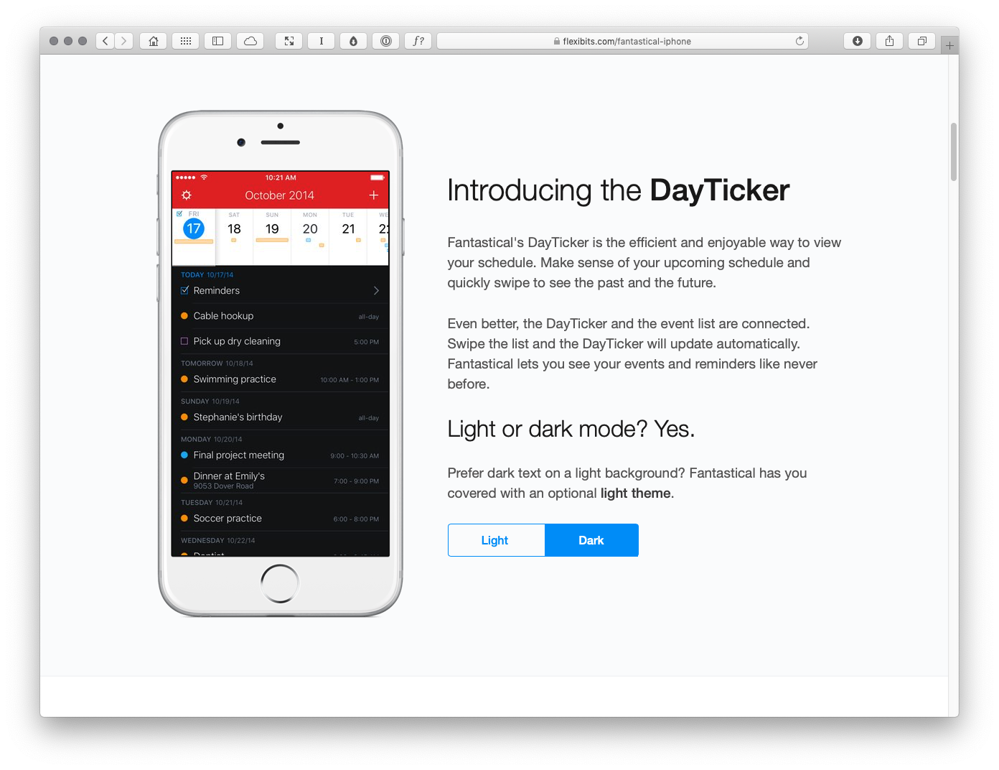
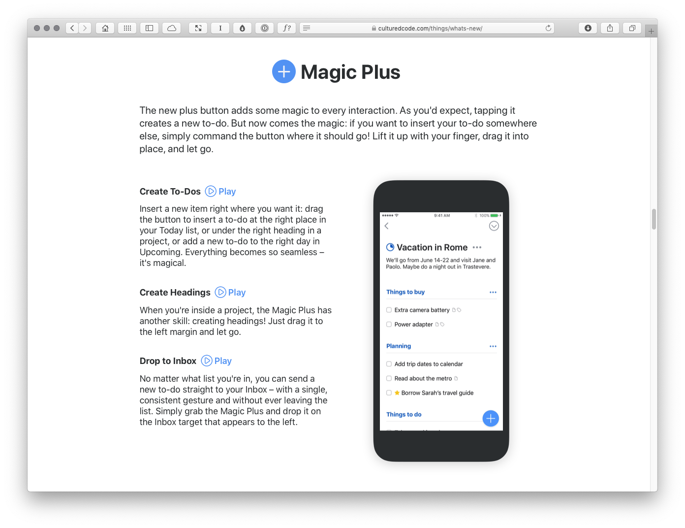

Master-Apprentice Exercises
===========================

You can learn a great deal by looking at others’ work and analysing it. Breaking down existing user interfaces and rebuilding them in XD will teach you how to ‘see through the eyes of others’.

I’ve included some ‘swipe files’ where I’ve analysed a variety of interfaces in different contexts:

+ Desktop
+ Mobile (Smartphone, Tablet)
+ Wrist

Looking at these interfaces and how they are structured will teach you about user interface design and information architecture in different environments.

I've undertaken a few exercises that I've included to show you how I learn by breaking apart others' work.

Desktop
-------

The desktop examples I've included are browser-focused, but the principles apply equally to desktop software.

### GOV.UK

The UK government's award-winning [GOV.UK](https://www.gov.uk) website is an excellent example of a website that simplifies complex information. It's user interface is clear and information-focused, which serves its users well. The information hierarchy – at both the site-level and the page-level – is clear, enabling users to navigate the information presented easily.

+ [Claim tax relief for your job expenses](https://www.gov.uk/tax-relief-for-employees)

### If the Moon Were Only 1 Pixel

A side project by Josh Worth, [If the Moon Were Only 1 Pixel](https://www.joshworth.com/portfolio-items/if-the-moon-were-only-1-pixel/) does a wonderful job of visualising complex information. I've intentionally included this more experiemtal example to show what's possible with very minimal building blocks of interfaces: points, lines and planes of color.

+ [If the moon were only 1 pixel…](http://joshworth.com/dev/pixelspace/pixelspace_solarsystem.html)

Mobile (Smartphone, Tablet)
---------------------------

The mobile examples I've included are for iOS (because I have an iPhone), but – broadly – the principles of information architecture and user interface design map over to other mobile platforms.

### Fantastical

Fantastical 2 for iOS by [Flexibits](https://flexibits.com) is a lovely example of an mobile application that condenses a great deal of information into a beautifully designed user interface. As a calendar and reminders app it has to fit a great deal into a small space and it does so minimally and elegantly.

+ [Fantastical](https://flexibits.com/fantastical-iphone)

### Things 3

Things 3 for iOS by [Cultured Code](#) is… In this file, I've also shown how Things 3 condenses down into a watchOS app so you can see the challenges of designing an application in two very different contexts.

Wrist
-----

As above, the wrist examples I've included are for Apple's watchOS (because I have an Apple Watch). If possible – and of course affording every single device is an issue – it helps to own the devices you're designing for so you can truly understand them by using them regularly. 

### Activity

---

I hope you find this resource useful. I’m also currently working on a book for the fine folks at Smashing Magazine – ‘Designing Delightful Experiences’ – which focuses on the user experience design process from start to finish. It will be published in late 2019.

You might like to [follow me](https://www.twitter.com/fehler) on Twitter for updates on that book and other projects I’m working on.

Copyright · Adobe XD + Mr Murphy Ltd.